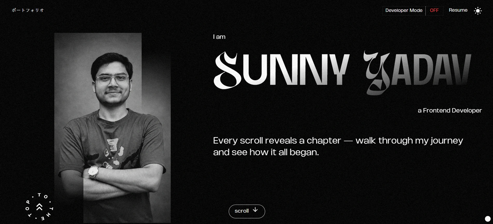

# Sunny Yadav - Fronted Developer Portfolio



## 📋 Table of Contents

- [About](#about)
- [Features](#features)
- [Tech Stack](#tech-stack)
- [Projects](#projects)
- [Installation](#installation)
- [Getting Started](#getting-started)
- [Deployment](#deployment)
- [SEO &amp; Performance](#seo--performance)
- [Contact](#contact)

---

## 👨‍💻 About

Welcome to my portfolio website! This is a modern, interactive portfolio showcasing my expertise in **Frontend development** with a focus on custom animations, responsive design, and performance optimization. Built with cutting-edge technologies, this portfolio demonstrates my skills in frontend development, animation design, and creating engaging user experiences.

## ✨ Features

### Portfolio Website

- **Custom Interactive Animations** - 10+ Framer Motion sequences including image slice animations, gradient text effects, smooth scroll triggers, custom cursor interactions, dynamic progress counters, and typing animations
- **Next.js & TypeScript** - Built with modern best practices, server-side rendering, and strong type safety
- **Responsive Design** - 100% mobile compatibility with smooth scrolling and adaptive UI
- **Email Integration** - Contact form with Resend API for automated notifications (99% delivery rate)
- **Performance & SEO Optimized** - Vercel Analytics integration with 95+ Lighthouse scores for performance, accessibility, and SEO
- **Dark/Light Mode** - Smooth theme switching with next-themes
- **Analytics** - Integrated Vercel Speed Insights and Analytics

### Project Showcases

#### 1. **Briefox** - AI Design Assistant

- **96 Performance**, **82 Accessibility**, **96 Best Practices**, **92 SEO** Lighthouse scores
- AI-powered design brief generator, font finder, and color palette extractor
- Zero-login convenience with Gemini API integration
- Monetized with Google Analytics, AdSense, and AdsTerra
- Live: [briefox.com](https://www.briefox.com/)

#### 2. **Arise** - Productivity Collaboration Platform

- Modular frontend with React and Redux
- Real-time task management with room-based collaboration
- JWT authentication with secure session management
- Leaderboard metrics for team engagement
- Live: [arise-hazel.vercel.app](https://arise-hazel.vercel.app/)

#### 3. **Oak Together** - Environmental Platform

- Interactive tree plantation and event management
- Live AQI Display with D3.js real-time visualization
- Google Maps API integration for interactive mapping
- Gemini API for AI-powered tree recommendations
- Gamified participation tracking
- Live: [oak-together-fkup.vercel.app](https://oak-together-fkup.vercel.app/)

#### 4. **TrustVibes** - Review & Testimonial Platform

- No-authentication feedback collection
- React + Firebase real-time database
- Admin dashboard for testimonial management
- iFrame embeddable testimonial display
- Live: [trust-vibes.vercel.app](https://trust-vibes.vercel.app/)

---

## 🛠️ Tech Stack

### Frontend

- **Next.js** - React framework for production
- **React 19** - UI library with latest features
- **TypeScript** - Strong type safety
- **TailwindCSS** - Utility-first CSS framework
- **Framer Motion** - Advanced animation library
- **next-themes** - Dark/Light mode implementation

### Backend & APIs

- **Node.js** - JavaScript runtime
- **Resend API** - Email delivery service
- **React Email** - Email template library
- **Vercel Analytics** - Performance monitoring
- **Vercel Speed Insights** - Web performance metrics

### Tools & Services

- **Vercel** - Deployment and hosting
- **Git & GitHub** - Version control
- **ESLint** - Code quality
- **Tailwind CSS PostCSS** - CSS processing

### Dependencies

```json
{
  "@emotion/react": "^11.14.0",
  "@emotion/styled": "^11.14.1",
  "@mui/icons-material": "^7.3.6",
  "@mui/material": "^7.3.6",
  "@react-email/components": "^1.0.4",
  "@react-email/render": "^2.0.2",
  "@vercel/analytics": "^1.6.1",
  "@vercel/speed-insights": "^1.3.1",
  "lenis": "^1.3.11",
  "motion": "^12.23.24",
  "next": "^16.1.0",
  "next-themes": "^0.4.6",
  "react": "19.1.0",
  "react-dom": "19.1.0",
  "react-syntax-highlighter": "^16.1.0",
  "resend": "^6.7.0",
  "simplex-noise": "^4.0.3"
}
```

---

## 🚀 Installation

### Prerequisites

- Node.js 18+
- npm or yarn package manager

### Step 1: Clone the Repository

```bash
git clone https://github.com/Its-sunny69/Sunny-Portfolio.git
cd Sunny-Portfolio
```

### Step 2: Install Dependencies

```bash
npm install
# or
yarn install
# or
pnpm install
```

### Step 3: Set Environment Variables

Create a `.env.local` file in the root directory:

```env
NEXT_PUBLIC_RESEND_API_KEY=your_resend_api_key
```

---

## 💻 Getting Started

### Development Server

Run the development server:

```bash
npm run dev
# or
yarn dev
# or
pnpm dev
```

Open [http://localhost:3000](http://localhost:3000) to see your portfolio in action.

### Build for Production

```bash
npm run build
```

### Run Production Build

```bash
npm run start
```

### Linting

```bash
npm run lint
```

---

## 📦 Deployment

### Deploy on Vercel (Recommended)

The easiest way to deploy is using [Vercel Platform](https://vercel.com):

1. **Push to GitHub**

   ```bash
   git push origin main
   ```
2. **Import to Vercel**

   - Go to [vercel.com](https://vercel.com)
   - Click "New Project"
   - Import your GitHub repository
   - Vercel will auto-detect Next.js settings
3. **Set Environment Variables**

   - In Vercel project settings, add:
     - `RESEND_API_KEY`: Your Resend API key
4. **Deploy**

   - Click "Deploy"
   - Your portfolio is now live!

### Custom Domain

- In Vercel project settings, add your custom domain
- Update DNS records as per Vercel's instructions

### Deployment Status

- **Current Deployment**: [https://sunny-portfolio-teal.vercel.app](https://sunny-portfolio-teal.vercel.app)
- **Auto-deploy**: Enabled on git push to main branch

---

## 📊 SEO & Performance

### Sitemap & Robots

- **Sitemap**: Automatically generated at `/sitemap.xml`
- **Robots.txt**: Configured for optimal crawling
- **Meta Tags**: Open Graph, Twitter Card, and structured data included

### Performance Metrics

- **Lighthouse Score**: 95+ (Accessibility, Best Practices, SEO)
- **Core Web Vitals**: Optimized
- **Mobile Friendly**: 100% responsive
- **Page Speed**: Optimized with image optimization and code splitting

### SEO Features

- Comprehensive metadata in layout
- Image sitemap with optimized assets
- Structured data and schema markup
- Mobile-first responsive design
- Fast loading times with Next.js optimization

---

## 📁 Project Structure

```
portfolio/
├── src/
│   ├── app/
│   │   ├── api/              # API routes (email sending)
│   │   ├── globals.css       # Global styles
│   │   ├── layout.tsx        # Root layout with metadata
│   │   ├── page.tsx          # Home page
│   │   ├── robots.ts         # Robots.txt configuration
│   │   └── sitemap.ts        # XML Sitemap
│   ├── assets/
│   │   ├── projects-images/  # Project screenshots
│   │   ├── programming-icons/# Tech stack icons
│   │   ├── tool-icons/       # Tool icons
│   │   └── screenshot.webp   # Portfolio screenshot
│   ├── components/           # Reusable React components
│   ├── context/              # Context providers
│   ├── data/                 # Static data (projects, skills)
│   └── fonts/                # Custom fonts
├── public/                   # Static assets
├── package.json              # Dependencies
├── next.config.ts            # Next.js configuration
└── README.md                 # This file
```

---

## 🔧 Configuration Files

### next.config.ts

- Image optimization
- Font optimization
- Build optimization

### tsconfig.json

- Strict type checking
- Path aliases (@/*)
- ES2020+ target

### tailwind.config.js

- Custom color scheme
- Font families (Nohemi, Dirtyline)
- Animation configurations

---

## 📞 Contact

I'd love to hear from you! Reach out through:

- **Email**: ranjeetyadav31638@gmail.com
- **GitHub**: [Its-sunny69](https://github.com/Its-sunny69)
- **Portfolio**: [sunny-portfolio-teal.vercel.app](https://sunny-portfolio-teal.vercel.app)

---

## 🙏 Acknowledgments

- [Next.js](https://nextjs.org) - React framework
- [Framer Motion](https://www.framer.com/motion/) - Animation library
- [TailwindCSS](https://tailwindcss.com) - Utility CSS framework
- [Vercel](https://vercel.com) - Deployment platform
- [Resend](https://resend.com) - Email service

---

## 📈 Roadmap

- [ ] Blog section with articles
- [ ] Project case studies with detailed breakdowns
- [ ] Interactive code snippets
- [ ] Video tutorials
- [ ] Live chat support
- [ ] Newsletter signup

---

**Made with ❤️ by Sunny Yadav**
